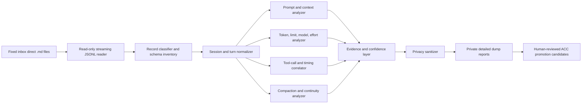

# fn-8-build-deep-codex-session-intelligence Build deep Codex session intelligence analyzer

## Goal & Context
<!-- scope: business -->

Upgrade the manual isolated session analyzer from generic key counting into an event-aware forensic and behavioral analysis tool for Codex session `.md` JSONL exports. The tool must extract every reliable observable signal that can improve ACC product design, workflow reliability, verification quality, and usage efficiency, while keeping raw evidence private and never claiming access to hidden model internals.

Target users are the ACC product owner and future ACC development chats reviewing manually supplied Codex sessions. Main value: explain what Codex was configured to see, what actions it took, what resources it consumed, where continuity or workflow failed, and which product changes may improve outcomes with lower usage-limit pressure.

## Overview

Current analyzer safely reads the fixed inbox and writes private Obsidian dumps, but its generic recursive walk creates incorrect semantics: cumulative token snapshots are added together, one compaction becomes three counts, model fields are counted as repeated occurrences rather than turns, and tool inventory is incomplete. This spec preserves the existing safety shell and replaces the extraction core with explicit schemas, event adapters, correlation, validation, and deterministic reports.

Chosen product shape combines maximum extraction with balanced intelligence. One streaming parse produces two synchronized layers: an exhaustive private forensic layer containing every reliable observable field and provenance, and a compact intelligence layer containing validated summaries, ranked waste, behavior findings, limitations, and promotion candidates. Maximum detail must not force future chats to reread multi-megabyte evidence for ordinary questions.

## Quick commands

```powershell
cd "C:\Users\Mitun Manav G Y\Desktop\Plugin development\session-analyzer"
python -m unittest discover -s tests -v
powershell -NoProfile -ExecutionPolicy Bypass -File .\run.ps1 -Label "deep-analyzer-validation"
```

## Architecture & Data Models
<!-- scope: technical -->



Core components:

1. Preserve existing fixed-inbox and dump-root guards in `session-analyzer/session_analyzer.py:16-139`.
2. Replace generic semantic counting in `session-analyzer/session_analyzer.py:180-281` with event-aware adapters for `session_meta`, `turn_context`, `response_item`, `event_msg`, and `compacted` records.
3. Build normalized session, turn, message, instruction-layer, tool-call, token-snapshot, rate-limit, timing, compaction, and outcome records. Preserve unknown event types and JSON paths in a schema inventory rather than dropping them.
4. Correlate calls and outputs by `call_id`; correlate task lifecycle by `turn_id`; retain source file and line provenance for every derived fact.
5. Separate raw fact, derived metric, heuristic inference, recommendation, and unknown. Every report item carries confidence and evidence references.
6. Keep full sanitized evidence local. Human-readable output defaults to aggregates, hashes, sizes, categories, short excerpts only when privacy policy allows, and explicit limitations.
7. Generate an exhaustive forensic evidence layer and a compact intelligence layer from the same normalized event stream. Both layers share metric IDs, formulas, confidence labels, and source references so summaries can always drill back to evidence without reparsing source files.
8. Add a deterministic insight-ranking engine. Rank findings by confidence, user impact, usage impact, recurrence, and verification strength; never rank speculative intelligence claims above supported operational evidence.

Observable extraction domains:

- Session identity: session id, source, originator, CLI version, provider, timestamps, thread linkage, working-context hashes, and source checksums.
- Prompt stack: base/developer/user message layers, AGENTS/project instruction presence, skill/plugin/tool catalog counts, dynamic tool schemas, prompt character/byte estimates, image attachments, and per-turn context-setting changes.
- Runtime configuration: model, effort, context-window size, summary mode, collaboration mode, personality, sandbox, approvals, permission profile, workspace roots, realtime and multi-agent flags.
- Turn lifecycle: start, first-token latency, completion, duration, abort, rollback, task status, user/assistant message sizes, and message sequence.
- Tool behavior: name, namespace, call id, sanitized arguments, output size, success/failure, duration when present, retries, repeated commands, read/write/network classification, call-to-output pairing, sequence, and orphaned calls/results.
- Token and limits: final cumulative snapshot per session, per-turn deltas from `last_token_usage`, cached/uncached ratio, output, reasoning output, total, context-window utilization, rate-limit percentages, windows, resets, plan type, credits, and hard-limit signals. Never sum cumulative snapshots.
- Reasoning observability: effort setting, reasoning-output token count, encrypted reasoning record count/size, summary presence, and outcome correlation. Never decrypt or present hidden chain-of-thought.
- Compaction: one logical compaction event deduplicated from related records, trigger/time, replacement-history shape, retained message counts, encrypted-summary size, pre/post context counters, and continuity evidence.
- Behavior and quality proxies: planning before action, tool-selection patterns, verification commands, success claims, user corrections, reversals, repeated failures, interrupted work, workflow-owner drift, state contradictions, and claims-versus-proof status.
- Efficiency: context amplification, repeated unchanged reads, large tool outputs, tool calls per completed turn, tokens per turn/tool/verified outcome, effort-to-outcome comparison, high-cost loops, and candidate lower-cost alternatives.
- Privacy: secret-shaped values, credentials, emails, paths, environment data, image references, prompt content risk, redaction counts, and leak checks.

## API Contracts
<!-- scope: technical -->

User-facing command remains manual and accepts only optional `-Label`. It reads all direct `.md` files from the fixed inbox and nowhere else.

A successful run creates one immutable timestamped dump folder containing at minimum:

- `manifest.md`: source identity, hashes, parser version, safety statement, and run result.
- `schema-inventory.json`: observed record types, JSON paths, field shapes, unknowns, and counts.
- `sessions.json`: normalized per-session metadata and final counters.
- `turns.jsonl`: normalized turn lifecycle and per-turn metrics.
- `tool-calls.jsonl`: paired calls/results with sanitized metadata and provenance.
- `metrics.json`: exact aggregate and derived metrics with formulas/version.
- `forensic-index.json`: exhaustive field/event/evidence index with stable evidence IDs and drill-down references.
- `intelligence-summary.json`: compact ranked findings, efficiency opportunities, confidence, and supporting metric/evidence IDs.
- `deep-report.md`: fact/inference/recommendation-separated human report.
- `limitations.md`: unavailable data, unstable transcript-format warning, and inference limits.
- `sanitized-evidence.jsonl`: privacy-filtered source evidence.
- `candidate-acc-brain-entries.md`: desensitized promotion candidates requiring approval.

Output schema receives a version. Unknown records remain represented. Deterministic input plus analyzer version produces deterministic analytical files except run timestamp/path fields.

## Approach

### Phase 1: Establish truth contract

Use the two supplied exports as private golden evidence. Define exact logical event rules, field provenance, stable/unstable source distinctions, formulas, and expected corrected metrics. Official Codex docs are supporting truth for behavior contracts; transcript fields remain observational and version-sensitive.

### Phase 2: Normalize before measuring

Stream each JSONL line once. Parse into explicit normalized records, build bounded indexes for `session_id`, `turn_id`, and `call_id`, and emit schema inventory. Avoid repeated whole-file scans and avoid loading raw multi-megabyte transcripts fully into memory.

### Phase 3: Compute exact mechanics

Calculate counters from event semantics, not recursive key matches. Use final cumulative token snapshot per session, validate against turn deltas, deduplicate compaction, pair every tool result, and report inconsistencies rather than inventing values.

### Phase 4: Add behavior analysis

Generate deterministic proxies from observable sequences. Keep subjective deep interpretation as a separate human/chat layer. Script may flag patterns and evidence but must not claim to know intent, intelligence, or hidden reasoning.

### Phase 5: Harden privacy and dual-layer reporting

Apply structural redaction before serialization, record redaction categories/counts, prevent prompt/tool-output leakage into summary files, and run leak fixtures. Produce a maximum-detail private forensic layer plus a compact ranked intelligence layer. Build both from the already-normalized stream so no second source scan is needed. Future chat should answer routine questions from compact outputs and open detailed evidence only for disputed or deep findings.

### Phase 6: Verify against current and adversarial fixtures

Prove corrected metrics for both real sessions, path isolation, source immutability, deterministic output, malformed/unknown event handling, missing call pairs, out-of-order events, cumulative counter resets, large-line streaming, and redaction safety.

## Boundaries / non-goals

- No automatic run, inbox watching, background process, hooks, MCP server, plugin manifest, or network access.
- No ACC runtime, ACC skill, plugin packaging, Flow mutation, config edit, worktree action, Git action, or installed-plugin access during analyzer runtime.
- No recursive file discovery and no caller-selected input paths.
- No automatic promotion into ACC brain.
- No decryption or reconstruction of hidden reasoning.
- No claim to reveal model weights, architecture internals, training data, proprietary algorithms, or direct intelligence measurements.
- No billing prediction from raw tokens unless official formula and required fields are available; report usage counters separately from included-limit consumption.
- No semantic judgement presented as exact fact.

## Decision context

Event-aware normalization is chosen over generic recursive counting because identical field names have different meanings across record types. A single streaming pass plus bounded correlation indexes gives high detail without repeated reads. Machine-readable normalized outputs reduce future chat token use because common questions can use compact metrics instead of loading multi-megabyte evidence. Script-owned deterministic facts and chat-owned interpretation remain separate to prevent false certainty.

Alternatives rejected:

- Generic key scanning: fast to write, semantically wrong.
- Loading whole transcript into memory: simpler correlation, poor scaling and unnecessary exposure.
- Direct ACC brain writes: risks contamination and secret leakage.
- AI-generated interpretation inside runtime: adds network/model dependency and defeats manual/local boundary.
- Treating encrypted reasoning as analyzable chain-of-thought: unsupported and misleading.

## Edge Cases & Constraints
<!-- scope: technical -->

- Transcript format is explicitly not a stable hook interface; adapters must tolerate version drift.
- Duplicate, missing, out-of-order, malformed, truncated, and unknown records must be reported with provenance.
- Cumulative counters may repeat or reset; formulas must distinguish snapshots from deltas.
- Tool outputs may be huge, binary-like, image-bearing, truncated, absent, or error-shaped.
- Developer/system content may contain private paths, secrets, tool schemas, or very large instructions.
- Timestamps may be strings, epoch values, absent, or inconsistent; preserve original and normalize only when valid.
- One logical action may produce multiple related event records; deduplication rules must be explicit and tested.
- Model/effort comparisons need adequate sample size and cannot imply causation.
- Efficiency report must show formulas and avoid recommending lower effort/model when evidence is insufficient.
- Sanitization must happen before any derived excerpt is written.
- Source files must hash identically before and after every run.

## Non-functional targets

- One streaming parse pass over each input for core extraction.
- Memory usage scales with normalized indexes, not full raw transcript size.
- Existing two-session corpus completes locally without network access.
- Compact summary files let chat answer routine audit questions without reading `sanitized-evidence.jsonl`.
- Every derived metric has formula, version, provenance, and validation status.
- Report generation is deterministic and testable.

## Acceptance Criteria
<!-- scope: both -->

- **R1:** Runtime preserves all fn-7 isolation, fixed-inbox, manual-run, immutable-output, and no-promotion guarantees.
- **R2:** Analyzer inventories all observed record types and JSON paths, preserves unknown records, and reports schema drift without failing valid runs.
- **R3:** Token engine reports correct final per-session and combined counters, per-turn deltas, cache ratios, context utilization, and limit signals without summing cumulative snapshots.
- **R4:** Prompt/context report distinguishes base, developer, user, project guidance, skills/plugins, dynamic tools, images, and turn configuration while minimizing exposed content.
- **R5:** Tool engine pairs calls/results across built-in, shell, patch, browser, MCP, custom, search, and deferred tools; reports latency, size, status, retries, repeats, and orphaned records.
- **R6:** Exactly one logical compaction is reported for the current thread-2 evidence, with related records and replacement-history facts linked rather than triple-counted.
- **R7:** Turn timeline reports lifecycle, duration, first-token latency, aborts, rollbacks, corrections, reversals, claims, verification evidence, and outcome status with source provenance.
- **R8:** Model, reasoning effort, reasoning-token, encrypted-reasoning-size, and outcome correlations are reported as observable proxies with sample-size and causation warnings.
- **R9:** Efficiency report identifies context replay, repeated reads, large outputs, tool loops, effort allocation, and tokens per useful unit using documented formulas and confidence labels.
- **R10:** Privacy layer structurally redacts secret-shaped data, credentials, emails, local paths, sensitive keys, and risky excerpts before output; leak tests pass.
- **R11:** Successful run emits versioned manifest, schema inventory, normalized sessions/turns/tools, metrics, deep report, limitations, sanitized evidence, and approval-gated ACC candidates.
- **R12:** Current two exports become golden validation evidence: 1,789 records, zero parse failures, correct source hashes, corrected 17,942,734 combined final tokens, 53 turn contexts, 256 shell calls plus all other tool types, and one logical compaction.
- **R13:** Tests cover malformed, unknown, duplicate, missing, out-of-order, truncated, huge, reset-counter, privacy, deterministic-output, source-immutability, and protected-path cases.
- **R14:** Documentation explains what Codex logs can and cannot reveal, cites local official Codex docs, states transcript instability, and gives safe interpretation rules.
- **R15:** No ACC source implementation, GitHub action, push, PR, merge, tag, publish, release, or remote branch action occurs under this spec without separate explicit user command.
- **R16:** Every successful run produces synchronized exhaustive-forensic and compact-intelligence layers from one normalized streaming pass; compact findings link to stable metric/evidence IDs and never require a second source-file scan.
- **R17:** Insight ranking is deterministic, formula-documented, confidence-aware, and prioritizes high-impact supported findings over speculative correlations.

## Early proof point

Task fn-8-build-deep-codex-session-intelligence.1 proves the extraction contract against the two real exports and locks corrected golden facts. If exact logical-event and token semantics cannot be established, stop before rebuilding the parser.

## Rollout and rollback

Rollout stays local. Existing analyzer version remains recoverable until replacement passes golden and safety tests. New output schema uses a version and writes only new timestamped run folders. Rollback means restore prior analyzer files; no migration or deletion of old dump runs is required.

## Documentation and metrics

Update analyzer README, analysis prompt, output schema documentation, Obsidian architecture/request/evidence notes, and Flow task evidence. Track parse failures, unknown record types, unpaired calls, redaction counts, validation warnings, runtime, peak-memory test result, output sizes, and corrected golden metrics.

## Risks and mitigations

- Transcript schema changes: versioned adapters, unknown-field inventory, fixtures.
- False intelligence claims: strict fact/inference/unknown taxonomy and limitations report.
- Privacy leakage: sanitize before serialization, leak fixtures, no automatic promotion.
- Metric drift: golden real-session expectations and formula versioning.
- Excess report size: normalized compact files, aggregate-first Markdown, full evidence separate.
- Analyzer touching protected system: retain path guards and add runtime access audit tests.

## References

- `session-analyzer/session_analyzer.py:16-139` - existing safety and path boundaries to preserve.
- `session-analyzer/session_analyzer.py:180-281` - generic analyzer core to replace.
- `session-analyzer/tests/test_session_analyzer.py` - existing safety regression base.
- `Projects/Anyone Can Code/23 Session Audit Master.md` - corrected real-session facts.
- `Projects/Anyone Can Code/25 Learning and Memory Compliance.md` - learning/state evidence.
- `Projects/Anyone Can Code/26 Session Findings and Roadmap.md` - product priorities.
- `Projects/Anyone Can Code/27 Session Analyzer Architecture.md` - approved isolation architecture.
- `Projects/Anyone Can Code/28 Session Analyzer Deep Upgrade Request.md` - current request and limits.
- `offical-codex-docs/core/prompting.md` - model/action loop, context, compaction.
- `offical-codex-docs/core/hooks.md` - hook events and transcript-format instability warning.
- `offical-codex-docs/core/skills.md` - progressive skill disclosure and context budget.
- `offical-codex-docs/core/subagents.md` - parallel-agent cost and configuration.
- `offical-codex-docs/core/pricing.md` - usage-limit and efficiency guidance.
- `offical-codex-docs/learn/best-practices.md` - prompting, context, model/effort, thread scope.

## Requirement coverage

| Req | Description | Task(s) | Gap justification |
|---|---|---|---|
| R1 | Preserve isolation and manual boundaries | .1, .2, .5, .6 | - |
| R2 | Complete schema inventory and drift handling | .1, .2 | - |
| R3 | Correct token/context/limit metrics | .1, .3, .6 | - |
| R4 | Prompt and context-layer analysis | .2, .4, .5 | - |
| R5 | Complete tool-call correlation | .2, .4, .6 | - |
| R6 | Logical compaction deduplication | .1, .4, .6 | - |
| R7 | Turn lifecycle and outcome evidence | .2, .4, .5 | - |
| R8 | Honest model/reasoning proxy analysis | .3, .5 | - |
| R9 | Efficiency metrics and recommendations | .3, .4, .5 | - |
| R10 | Structural privacy and leak prevention | .2, .5, .6 | - |
| R11 | Versioned output suite | .2, .3, .4, .5 | - |
| R12 | Golden current-session facts | .1, .3, .4, .6 | - |
| R13 | Adversarial and deterministic tests | .1, .6 | - |
| R14 | Official-doc-based limitations and docs | .1, .5, .6 | - |
| R15 | No remote or ACC implementation actions | all | - |
| R16 | Dual exhaustive and compact output layers from one pass | .2, .5, .6 | - |
| R17 | Deterministic confidence-aware insight ranking | .4, .5, .6 | - |
