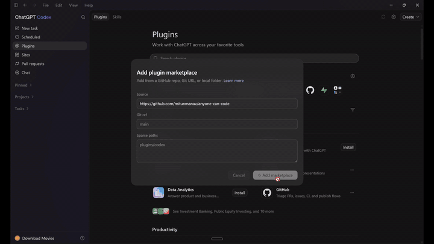

<p align="center">
  
</p>

<h1 align="center">Anyone Can Code</h1>

<p align="center">
  <strong>Vibe coding with an AI agent just got a real harness.</strong><br/>
  Free <strong>Codex Desktop + CLI</strong> plugins. Plan → build → verify in plain English.<br/>
  Apps, docs, fixes, whole projects — not chat thrash.
</p>

<p align="center">
  <strong>Languages:</strong>
  English ·
  <a href="readmes/README.pt-BR.md">Português</a> ·
  <a href="readmes/README.es.md">Español</a> ·
  <a href="readmes/README.zh-CN.md">简体中文</a> ·
  <a href="readmes/README.ja.md">日本語</a> ·
  <a href="readmes/README.ko.md">한국어</a> ·
  <a href="readmes/README.hi.md">हिन्दी</a> ·
  <a href="readmes/README.fr.md">Français</a> ·
  <a href="readmes/README.de.md">Deutsch</a>
</p>

<p align="center">
  <a href="https://anyone-can-code.vercel.app/"></a>
  <a href="ROADMAP.md"></a>
  <a href="https://discord.gg/qgS29y7TqP"></a>
  <a href="https://github.com/mitunmanav/anyone-can-code/actions/workflows/validate.yml"></a>
  <a href="https://github.com/mitunmanav/anyone-can-code/releases"></a>
  <a href="LICENSE"></a>
  
  
  
</p>

---

## Why ACC

Codex can do almost anything: ship product, write docs, fix bugs, start from a one-line idea.  
What people get stuck on is the **session** — scope, memory, “is it done?”, endless thrash.

**Anyone Can Code is the harness** for that work:

| | |
|--|--|
| **Plan** | Clear path before big changes |
| **Build** | Step by step, with memory that stays on your machine |
| **Verify** | Real “done” with proof — not “looks fine” |

Native Codex plugins — built from [Codex official docs](https://openai.com/codex/), not ported from Claude, Cursor, or other agents.

I’m **Mitun**. One product I shipped with ACC: [Everything AI v0.4.2](https://github.com/mitunmanav/everything-ai/releases/tag/v0.4.2). Open beta **v1.1.0-beta.4**.

**You need:** [Codex](https://openai.com/codex/) (Desktop and/or CLI) · Python

**New here?** [First day guide](docs/FIRST_DAY.md) · [Website install](https://anyone-can-code.vercel.app/#install)

---

## Two packages, one marketplace

Same GitHub repo. Same marketplace URL. **Two separate plugins.**  
Codex does **not** auto-pick — install the one that matches how you use Codex.

| | **Anyone Can Code** (Desktop) | **Anyone Can Code CLI** |
|--|------------------------------|-------------------------|
| **Use when** | Codex Desktop app | Codex CLI terminal (`codex`) |
| **Marketplace name** | Anyone Can Code | Anyone Can Code CLI |
| **Folder in repo** | `plugins/anyone-can-code/` | `plugins/anyone-can-code-cli/` |
| **Install UI** | App → **Plugins** | CLI → **`/plugins`** |
| **Trust hooks** | Hooks settings in the app | CLI → **`/hooks`** |
| **More detail** | [plugins/anyone-can-code/README.md](plugins/anyone-can-code/README.md) | [plugins/anyone-can-code-cli/README.md](plugins/anyone-can-code-cli/README.md) |

**Do not install both** unless you really use both hosts. Pick one per machine.

---

## Install — Desktop

<p align="center">
  
</p>

1. Copy: `https://github.com/mitunmanav/anyone-can-code`
2. Codex Desktop → **Plugins** → **+** → **Add a Marketplace** → paste the URL  
3. Find **Anyone Can Code** (Desktop package) → **Install**  
   - Do **not** pick **Anyone Can Code CLI** here unless you also use the terminal CLI  
4. **Hooks** → enable + **trust** every ACC hook (required — Codex does not auto-trust)  
5. **Restart** Codex · confirm tools are on  
6. Open a project folder → `$setup` → say what you want  

Video: [docs/media/install-setup.mp4](docs/media/install-setup.mp4) · [website walkthrough](https://anyone-can-code.vercel.app/#install)

---

## Install — CLI

For the **terminal** Codex app only.

1. Add the marketplace (once):

```bash
codex plugin marketplace add mitunmanav/anyone-can-code --ref main
```

2. Start Codex in a project folder: `codex`  
3. Type **`/plugins`** → install **Anyone Can Code CLI**  
   - Not the Desktop-only package name  
4. Type **`/hooks`** → review + **trust** ACC hooks (required)  
5. New thread → `$setup` → say what you want  

Optional check after install:

```bash
# from this repo (developers)
python3 -m pytest plugins/anyone-can-code-cli/tests -q
python3 plugins/anyone-can-code-cli/scripts/doctor.py --json
```

---

## If something fails

| What you see | What to try |
|--------------|-------------|
| Marketplace / install fails | Paste the **full** GitHub URL, not a short name |
| Installed wrong package | Uninstall the other one; install Desktop **or** CLI name that matches your host |
| Plugin installed but nothing works | **Trust all ACC hooks**, then restart / new thread |
| CLI hooks never run | `/hooks` → trust (Codex skips untrusted plugin hooks) |
| `$setup` does nothing | Open a **project folder** first, start a **new chat**, try `$setup` again |
| Still stuck | [FAQ](https://github.com/mitunmanav/anyone-can-code/discussions/9) or [report a problem](https://github.com/mitunmanav/anyone-can-code/issues/new/choose) |

[Discord](https://discord.gg/qgS29y7TqP) for quick questions. Issues when something is broken.

---

## Useful commands (both packages)

You can also talk in plain English.

| Command | When to use it |
|---------|----------------|
| `$setup` | First time in a project |
| `$orchestrator` | Front door when you are not sure where to start |
| `$help` / `$status` | Where you are and what is next |
| `$resume` | Continue after a break |
| `$verify` | Check that work is really done |
| `$fix` | When the same thing keeps failing |

CLI-only tips: long job → `/goal` · before ship → `/review` · model → `/model`

---

## Repo layout (developers)

```
plugins/anyone-can-code/       # Desktop package
plugins/anyone-can-code-cli/   # CLI package (full copy + CLI-tuned hooks)
.agents/plugins/marketplace.json
```

Local gate (Desktop package):

```bash
python3 -m pytest plugins/anyone-can-code/tests -q
python3 plugins/anyone-can-code/scripts/doctor.py --json
```

Local gate (CLI package):

```bash
python3 -m pytest plugins/anyone-can-code-cli/tests -q
python3 plugins/anyone-can-code-cli/scripts/doctor.py --json
```

---

## Roadmap

What is next (plain words, no hard dates — plans can change):

| When | Focus |
|------|--------|
| **Now · beta.4** | Two-drawer memory · never repeat a lesson · plain-words progress · honest push-back · safety guards |
| **Next · beta.5** | Plays-nice plugin list · smarter model choice · never lose work at usage limits |

Full detail: **[ROADMAP.md](ROADMAP.md)** · [pinned issue](https://github.com/mitunmanav/anyone-can-code/issues/14) · [Discussion](https://github.com/mitunmanav/anyone-can-code/discussions/13) · [website](https://anyone-can-code.vercel.app/#roadmap)

---

## Help

| Link | What |
|------|------|
| [First day with ACC](docs/FIRST_DAY.md) | Install check → `$setup` → first ask → `$status` / `$help` |
| [FAQ](https://github.com/mitunmanav/anyone-can-code/discussions/9) | Common questions |
| [Website install](https://anyone-can-code.vercel.app/#install) | Desktop + CLI steps + video |

---

## Links

[Website](https://anyone-can-code.vercel.app/) · [Roadmap](ROADMAP.md) · [First day](docs/FIRST_DAY.md) · [Discussions](https://github.com/mitunmanav/anyone-can-code/discussions) · [Privacy](docs/PRIVACY.md) · [Terms](docs/TERMS.md) · [Contributing](.github/CONTRIBUTING.md)
