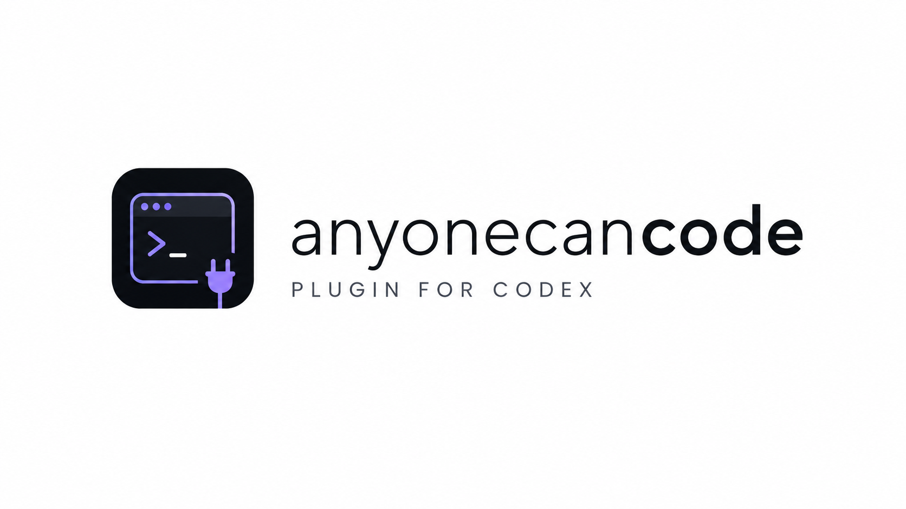

<p align="center">
  
</p>

<h1 align="center">Anyone Can Code</h1>

<p align="center">
  <strong>Reliability workflow plugin for OpenAI Codex CLI.</strong><br/>
  Say what you want. ACC helps Codex plan it, build it, and prove it works.<br/>
  <em>This package is for the terminal CLI only.</em> Desktop app users: install <strong>Anyone Can Code</strong>.
</p>

<p align="center">
  <a href="https://anyone-can-code.vercel.app/"></a>
  <a href="https://discord.gg/qgS29y7TqP"></a>
  <a href="https://github.com/mitunmanav/anyone-can-code/actions/workflows/validate.yml"></a>
  <a href="https://github.com/mitunmanav/anyone-can-code/releases"></a>
  <a href="../../LICENSE"></a>
  
  
</p>

**New here?** [First day guide](../../docs/FIRST_DAY.md) · Full install: [root README — CLI](../../README.md#cli)  

**Install GIF (in this repo):** [docs/media/install-setup.gif](../../docs/media/install-setup.gif)  
**Full video:** [docs/media/install-setup.mp4](../../docs/media/install-setup.mp4) · [website player](https://anyone-can-code.vercel.app/#install)  

**Stuck?** [Start here](https://github.com/mitunmanav/anyone-can-code/discussions/5) · [FAQ](https://github.com/mitunmanav/anyone-can-code/discussions/9)

### Install (short)

**CLI package** (not Desktop). Desktop users install **Anyone Can Code** instead.

1. `codex plugin marketplace add mitunmanav/anyone-can-code --ref main` (or local path)
2. `codex` → `/plugins` → **Anyone Can Code CLI** → Install
3. `/hooks` → trust ACC hooks
4. New thread · project folder · `$setup`

**Current version:** [plugin.json](.codex-plugin/plugin.json) · [Releases](https://github.com/mitunmanav/anyone-can-code/releases)

### If install fails

| What you see | What to try |
|--------------|-------------|
| Marketplace not found / add fails | Use full repo `mitunmanav/anyone-can-code` (or the full GitHub URL) |
| Wrong package | Uninstall Desktop-only name; install **Anyone Can Code CLI** |
| Plugin installed but nothing works | `/hooks` → **trust every ACC hook** → new thread |
| `$setup` no reply | Run `codex` inside a **project folder**, new thread, try `$setup` again |

More: [FAQ](https://github.com/mitunmanav/anyone-can-code/discussions/9) · [Install issue form](https://github.com/mitunmanav/anyone-can-code/issues/new?template=install_problem.yml) · [root troubleshooting](../../README.md#if-something-fails)

---

## Everyday commands (start here)

Type these in the Codex chat (or pick the short **ACC …** name in the app). You can also just talk in plain English.

| In app | Type this | What it does (simple) |
|--------|-----------|------------------------|
| ACC setup | `$setup` | First-time setup for this project |
| ACC home | `$orchestrator` | Front door — helps pick the next step |
| ACC help | `$help` | “Where am I?” in plain language |
| ACC status | `$status` | Current task and what’s next |
| ACC resume | `$resume` | Continue after a break |
| ACC check | `$verify` | Check the work with proof |
| ACC fix | `$fix` | Help when the same thing keeps failing |

---

## More skills (optional)

| In app | Type this | What it does |
|--------|-----------|-------------|
| ACC start | `$onboard` | Idea / existing project / bug starting points |
| ACC clarify | `$clarify` | Only the questions needed to unblock you |
| ACC plan | `$plan` | Ordered task plan |
| ACC build | `$execute` | Build from the plan |
| ACC learn | `$learn` | Save a lesson to memory |
| ACC wiki | `$wiki` | Save, ask, or clean project notebook (ACC only; no Codex native memory) |
| ACC note | `$capture` | Record a decision or blocker |
| ACC scope | `$govern` | Guard against silent scope change |
| ACC clear | `$readable` | Keep work understandable |
| ACC plugins | `$bridge` | Play nice with other plugins |
| ACC usage | `$usage` | Token usage view |
| ACC settings | `$settings` | Preferences |
| ACC update | `$update` | After a plugin upgrade |
| ACC handoff | `$handoff` | Pass work to a later session |

---

## Memory (short)

- Durable memory = linked Markdown files  
- Recalled before questions, plans, and actions  
- Advises — never decides alone  
- Viewer optional (e.g. Obsidian); ACC works without one  

Details: [`MEMORY-CONTRACT.md`](MEMORY-CONTRACT.md)

---

## Automations

Optional read-only Codex Desktop schedules (daily recap, stuck nudge, weekly memory digest): [`automations/`](automations/README.md)

---

## Tests

Run the suite locally (CI runs the same path):

```powershell
python -m pytest plugins/anyone-can-code/tests -q
```

Do not hardcode pass counts in docs — trust CI and the command above.

---

## Safeguards

ACC enforces `mechanics_docs_gate` before any platform mechanics work — hooks, plugin runtime, Windows launch, MCP, or tool-plumbing changes require a docs brief from official docs/source before code is written. When official docs are missing, controlled proof plus recorded uncertainty is required. This blocks silent assumptions about platform mechanics.

---

## Deeper docs

| Doc | For |
|-----|-----|
| [Root README](../../README.md) | Install + everyday commands |
| [docs/README](../../docs/README.md) | Map of all repo docs |
| [`IMPLEMENTATION-SOURCE-OF-TRUTH.md`](IMPLEMENTATION-SOURCE-OF-TRUTH.md) | What shipped |
| [`VALIDATION.md`](VALIDATION.md) | Acceptance checklist |
| [`MEMORY-CONTRACT.md`](MEMORY-CONTRACT.md) | Memory rules |
| [CONTRIBUTING](../../.github/CONTRIBUTING.md) | How to contribute |
| [Privacy](../../docs/PRIVACY.md) · [Terms](../../docs/TERMS.md) | Legal |

---

<p align="center">
  <sub>MIT · Built by <a href="https://github.com/mitunmanav">Mitun</a> · <a href="https://anyone-can-code.vercel.app/">anyone-can-code.vercel.app</a></sub>
</p>
