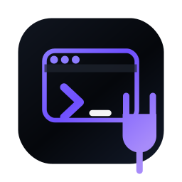

<p align="center">
  
  <br/>
  
</p>

<h3 align="center">Anyone Can Code</h3>
<p align="center">
  Idea → plan → build → verify. A Codex plugin for Windows. No engineering background required.
</p>

<p align="center">
  <a href="https://anyone-can-code.vercel.app/"></a>
  <a href="https://discord.gg/qgS29y7TqP"></a>
  
  
  
</p>

Full install guide lives in the [root README](../../README.md). Short version:

```powershell
codex plugin marketplace add mitunmanav/anyone-can-code --ref main
```

Install **Anyone Can Code** in the Codex plugin browser → restart → open a project → `$setup`.

---

## Skills

| Skill | What it does |
|-------|-------------|
| `$orchestrator` | Front door — detects starting point and routes |
| `$onboard` | Idea / spec / existing repo / bug |
| `$clarify` | Only the questions needed to unblock |
| `$plan` | Ordered task plan |
| `$execute` | Build from the plan; update state |
| `$verify` | Evidence-first completion check |
| `$fix` | Recovery when something keeps failing |
| `$resume` | Continue after interrupt or restart |
| `$learn` | Save a lesson to Markdown memory |
| `$capture` | Record a decision, blocker, or insight |
| `$status` | Where things stand |
| `$help` | Project state in plain language |
| `$govern` | Guard against silent scope change |
| `$readable` | Keep code and artifacts understandable |
| `$bridge` | Detect other plugins; route safely |
| `$usage` | Token usage dashboard |
| `$settings` | Persona, verbosity, automation |
| `$setup` | First-use bootstrap |
| `$update` | Migrate state after plugin upgrade |
| `$handoff` | Structured session handoff |

---

## Memory (short)

- Durable memory = linked Markdown files  
- Recalled before questions, plans, and actions  
- Advises — never decides alone  
- Viewer optional (e.g. Obsidian); ACC works without one  

Details: [`MEMORY-CONTRACT.md`](MEMORY-CONTRACT.md)

---

## Automations

Read-only Codex Desktop schedules (daily recap, stuck nudge, weekly memory digest): [`automations/`](automations/README.md)

---

## Tests

**363 passed · 3 skipped · 0 failures** (local suite)

```powershell
python -m pytest plugins/anyone-can-code/tests -q
```

---

## Safeguards

ACC enforces `mechanics_docs_gate` before any platform mechanics work — hooks, plugin runtime, Windows launch, MCP, or tool-plumbing changes require a docs brief from official docs/source before code is written. When official docs are missing, controlled proof plus recorded uncertainty is required. This blocks silent assumptions about platform mechanics.

## Deeper docs

| Doc | For |
|-----|-----|
| [`IMPLEMENTATION-SOURCE-OF-TRUTH.md`](IMPLEMENTATION-SOURCE-OF-TRUTH.md) | What shipped |
| [`VALIDATION.md`](VALIDATION.md) | Acceptance checklist |
| [`MEMORY-CONTRACT.md`](MEMORY-CONTRACT.md) | Memory rules |
| [CONTRIBUTING](../../.github/CONTRIBUTING.md) | How to contribute |

---

<p align="center">MIT · Built by <a href="https://github.com/mitunmanav">Mitun</a></p>
