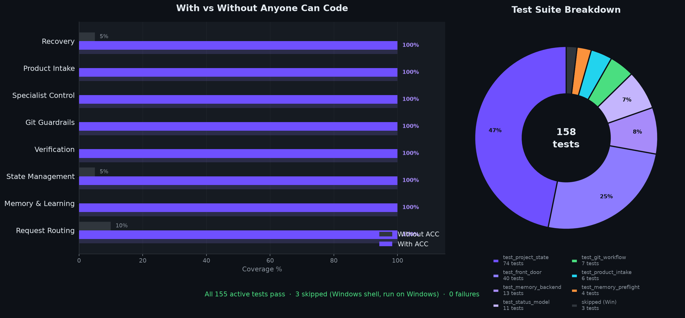

<p align="center">
  
  <br/>
  
</p>

<h3 align="center">Anyone Can Code</h3>
<p align="center">
  A Codex plugin that takes you from idea to verified result — no engineering background required.
</p>

<p align="center">
  <a href="https://anyone-can-code.vercel.app/"></a>
  <a href="https://discord.gg/qgS29y7TqP"></a>
  <a href="https://anyone-can-code.vercel.app/#waitlist"></a>
  
  
  
</p>

---

## What it does

You describe what you want. Anyone Can Code handles the rest.

- **Idea → plan** in one conversation
- **Routes** to the right workflow automatically — idea, bug, feature, review, or ship
- **Remembers** your decisions across sessions using portable Markdown memory
- **Verifies** work before claiming it's done — no silent success claims
- **Windows-first** — built for Codex Desktop on Windows

```
You:  "I want to build a website with auth and payments"

ACC:  Detected: idea + website
      Relevant memory used: 1 item (prefer Stripe over manual billing)
      Route: intake → checklist → plan
      Plan: website + auth + Stripe. SEO later.
```

---

## Install

```powershell
# Add the marketplace (copy-paste the repo URL)
codex plugin marketplace add https://github.com/mitunmanav/anyone-can-code

# Or GitHub shorthand
codex plugin marketplace add mitunmanav/anyone-can-code --ref main

# Then install via Codex plugin browser, restart, and open a new thread
```

First use:

```
$setup
```

---

## Skills

| Skill | What it does |
|-------|-------------|
| `$orchestrator` | Front door — detects your starting point and routes |
| `$onboard` | Detects idea / spec / existing repo / bug |
| `$clarify` | Asks only the questions needed to unblock |
| `$plan` | Turns a clear request into an ordered task plan |
| `$execute` | Builds from the task plan, updates workflow state |
| `$verify` | Evidence-first completion check |
| `$resume` | Picks up after interruption or restart |
| `$learn` | Saves a lesson to portable Markdown memory |
| `$status` | Where things stand right now |
| `$settings` | Persona, verbosity, automation level |
| `$update` | Migrates project state after plugin upgrade |

---

## Test results

**207 tests · 3 skipped (Windows shell) · 0 failures**

<p align="center">
  
</p>

| Suite | Tests | What it covers |
|-------|-------|----------------|
| `test_project_state` | 74 | State reads/writes, setup, update, memory migration, rollback, safety receipts, subagent rules |
| `test_front_door` | 40 | Routing logic, specialist containment, ownership contract, bridge detection |
| `test_memory_backend` | 13 | Markdown memory store, recall, deduplication |
| `test_status_model` | 11 | State vocabulary, verification claims, visual QA guards |
| `test_git_workflow` | 7 | Git guardrails, branch/commit/PR rules |
| `test_product_intake` | 6 | Intake questions, checklist generation, plan line |
| `test_memory_preflight` | 4 | Memory recall before first action |
| `test_domain_router` | 8 | Domain routing, UX coverage, skip/defer filtering, fallback instructions |

Run locally:

```powershell
python -m unittest discover -s plugins/anyone-can-code/tests
```

---

## Memory model

- Durable memory = linked Markdown files (not a database)
- Recalled before every question, plan, or action
- Project → user → shared scope hierarchy
- Top 3–5 results only — memory advises, never decides
- Optional viewer (Obsidian) — ACC works without any viewer

---

## Community

| | |
|---|---|
| 🌐 Website | [anyone-can-code.vercel.app](https://anyone-can-code.vercel.app/) |
| 💬 Discord | [discord.gg/qgS29y7TqP](https://discord.gg/qgS29y7TqP) |
| 📋 Waitlist | [Join the waitlist](https://anyone-can-code.vercel.app/#waitlist) |

---

## Safeguards

ACC enforces `mechanics_docs_gate` before any platform mechanics work — hooks, plugin runtime, Windows launch, MCP, or tool-plumbing changes require a docs brief from official docs/source before code is written. When official docs are missing, controlled proof plus recorded uncertainty is required. This blocks silent assumptions about platform mechanics.

## Reference

- [`IMPLEMENTATION-SOURCE-OF-TRUTH.md`](IMPLEMENTATION-SOURCE-OF-TRUTH.md) — what was added, changed, removed
- [`VALIDATION.md`](VALIDATION.md) — acceptance checklist
- [`MEMORY-CONTRACT.md`](MEMORY-CONTRACT.md) — full memory spec
- [`DEVELOPMENT-WORKFLOW.md`](../../DEVELOPMENT-WORKFLOW.md) — how to contribute

---

<p align="center">MIT License · Built by <a href="https://github.com/mitunmanav">Mitun</a></p>
